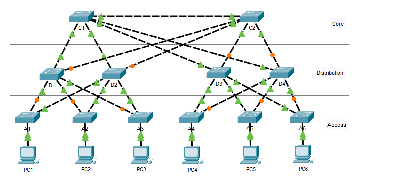
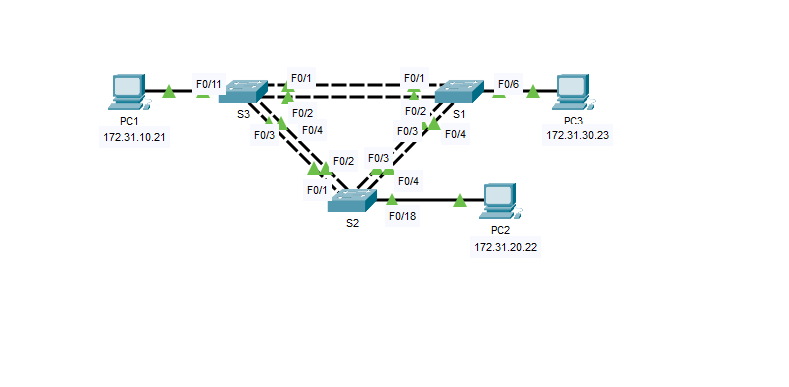
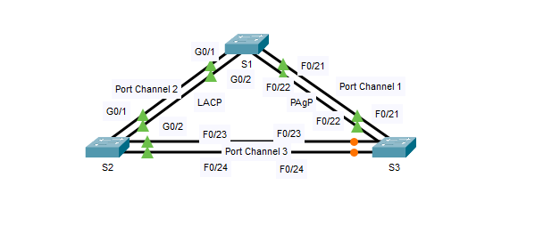
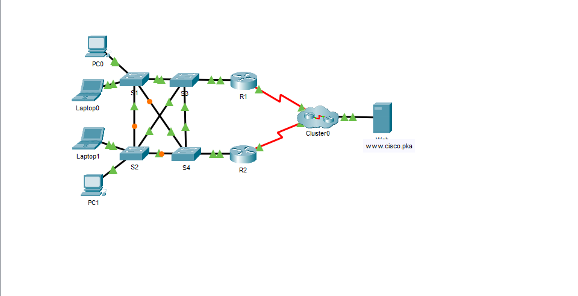
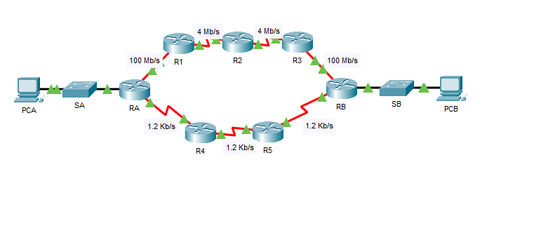

# Cisco Packet Tracer Infrastructure Library

Welcome to my networking portfolio. This directory showcases a library of 6 production-grade network simulations built within Cisco Packet Tracer. 

These labs validate my practical understanding of high-availability gateway routing, loop-free switching, link aggregation, secure remote access, and advanced infrastructure troubleshooting—the core components needed to design stable Microsoft Azure environments.

---

## 📁 The 6-Project Topology Portfolio

### 1. Lab 3.1.1.5: Examining a Redundant Design

* **Core Concepts:** First-Hop Redundancy baselines, Spanning Tree Protocol (STP) convergence, and backup default gateway tracking.
* **The Cloud Pivot:** Mirrors high-availability designs used to orchestrate load-balanced, multi-zone availability structures inside Azure.
* **About:** This project demonstrates enterprise-grade LAN switching principles. It utilizes redundant physical topologies across three distinct infrastructure tiers, isolating end-user access while optimizing high-speed core backbone routing and eliminating single points of failure via strategic STP path blocking.

### 2. Lab 3.3.1.5: Configuring PVST+ (Per-VLAN Spanning Tree)

* **Core Concepts:** Root bridge election customization, load balancing traffic across independent VLAN paths, and eliminating Layer 2 network loops.
* **The Cloud Pivot:** Aligns directly with segmenting enterprise multi-tenant traffic securely across complex virtualization layers.
* **About:** This project focuses on resolving enterprise bandwidth bottlenecks and optimizing link efficiency. By bundling physical fast-ethernet interfaces into logical EtherChannels, the topology establishes high-throughput trunks while mitigating Spanning Tree link blocking, maximizing link utilization, and maintaining hardware-level redundancy.

### 3. Lab 4.2.1.3: Configuring EtherChannel (Link Aggregation)

* **Core Concepts:** PAgP/LACP configurations, combining multiple physical links into one logical high-throughput connection, and interface bandwidth scaling.
* **The Cloud Pivot:** Translates directly to network bandwidth pooling concepts like Azure Virtual Network Peering and high-speed ExpressRoute gateway links.
* **About:** This repository serves as a deep-dive laboratory benchmarking enterprise Link Aggregation protocols. The topology establishes a redundant triangular switch mesh utilizing both LACP and PAgP. It deliberately triggers Spanning Tree Protocol (STP) to analyze how loop-prevention algorithms calculate root-path costs and block traffic at the logical Port-Channel level rather than individual physical interfaces.

### 4. Lab 4.3.4.4: Troubleshoot HSRP (Hot Standby Router Protocol)

* **Core Concepts:** Active/Standby router priority resolution, tracking timers configuration, and diagnosing virtual MAC address assignment failures.
* **The Cloud Pivot:** Directly mimics cloud incident response workflows, ensuring automated infrastructure failovers operate seamlessly without traffic degradation.
* **About:** This repository contains an end-to-end Enterprise WAN Edge topology demonstrating seamless transition from local Layer 2 access control to Layer 3 boundary routing. The project highlights infrastructure high-availability through gateway redundancy protocols, fault-tolerant distribution switch meshes, and WAN edge encapsulation, ensuring resilient endpoint access to external cloud enterprise web services.

### 5. Lab 5.2.1.4: Configuring SSH (Secure Remote Management)

* **Core Concepts:** Disabling insecure Telnet access, generating RSA cryptographic keys, and enforcing encrypted administrative VTY line access.
* **The Cloud Pivot:** Connects directly with cloud security policies that mandate closing public management ports and enforcing encrypted SSH/Bastion access to cloud VMs.
* **About:** This repository functions as an enterprise network device hardening and initial provisioning laboratory. It simulates a clean out-of-box environment via a direct console host, demonstrating the manual implementation of baseline security baselines. Key configurations include disabling insecure protocols, applying cryptographic secret hashing, establishing local AAA authentication parameters, and configuring secure remote access (SSHv2) management parameters.

### 6. Lab 5.2.3.4: Comparing RIP and EIGRP Path Selection

* **Core Concepts:** Administrative Distance comparison metrics, composite routing weights (bandwidth/delay), and dynamic routing table convergence.
* **The Cloud Pivot:** Provides the core routing knowledge required to design custom User Defined Routes (UDRs) and BGP route propagation in Azure networks.
* **About:** This repository serves as an advanced Layer 3 traffic engineering and routing metric laboratory. By constructing two distinct asymmetrical WAN trajectories with varied bandwidth profiles (100Mbps down to 1.2Kbps), this project benchmarks how different routing protocols calculate metrics. It explicitly demonstrates how OSPF utilizes bandwidth-based cost equations to bypass low-hop, low-bandwidth bottlenecks in favor of higher-throughput, multi-node paths.
